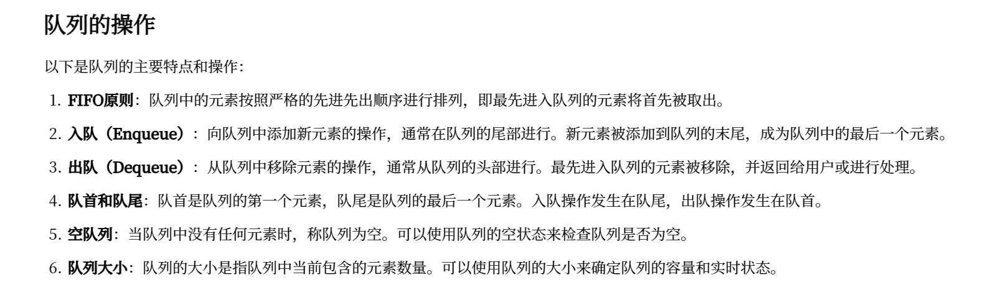

## Day1 数据传输网络介绍

线性结构和树形结构都可以视为是有向无环图DAG的简化

四大数据结构都可以统一表示为**有向无环图**

### 传输方式

* 广搜 队列搜素
* 深搜 栈式搜索

### 传输优化

* 减治 无效优化 解决P问题
* 动规 重叠优化 解决NP问题（指数问题和阶乘问题）

### DAG的储存：

一是如何知道DAG的所有节点 二是如何知晓一个结点的相邻节点 ==> 二维

* 顺序存储
* 哈希存储
* 索引存储

有向无环图需要两个一对多的关系 一般是 顺序-顺序 或者 哈希-哈希 二维存储结构

斐波那契序列：

点：F(n) 代表斐波那契数

边：F(n) = F(n-1) + F(n-1)

序：先序FOR循环 / DFS

### 递推公式

到达cur的最短路径

* dp[cur] = min(dp[pre] + len[pre][cur])

到达cur的最长路径 S_746 最短花费爬楼梯

* dp[cur] = max(dp[pre] + len[pre][cur])

到达cur的路径个数 S_70 爬楼梯

* dp[cur] = sum(dp[pre])

### 回溯算法与DFS

**回溯算法 = 深度优先搜索 + 剪枝函数**

* 回溯算法是一种思想
* dfs 是使用回溯算法解决的经典案例

## Day2 BFS的先序数据传输

### Queue 队列仅支持先序数据传输



### BFS 广度优先算法 依赖队列

#### 拓扑排序解决有向无环图问题

S_509 斐波那契数列

点：1...N

边：F(N) = F(N-1) + F(N-2)

序：先序BFS

解决一层再去下一层 队列中存的是已知点

用BFS 写斐波那契 考虑入度 入度=0 代表是已知的值 入队 起手传入 0 和 1

出队的时候 考虑他是谁的邻接点 把他的邻接点的入度-1


| f[n]为第 n+1 项的斐波那契数                | f[n] = f[n-1]+f[n-2]                       | 先序：BFS 邻接 |
| ------------------------------------------ | ------------------------------------------ | -------------- |
| indeg[n]表示f[n]这个点还要接收多少个点的值 | 每次接收到前驱节点传过来的的值，indeg[n]-- | 先序：BFS 邻接 |

### 拓扑排序解决有向无环图问题

1. 初始化点 用数据传输方式作为边 初始化DAG的入度和邻接表 邻接表存储的格式是 节点 前置节点
2. 创建队列 将入度为0的点加入队列
3. 队列不为空时pop 处理入度 将入度为0的新节点加入队列

```

class Solution {
public int fib(int n) {
if(n == 0) return 0;
if(n == 1) return 1;
int[] dp = new int[n+1];
dp[0] = 0;
dp[1] = 1;
int[] indeg = new int[n+1];
Arrays.fill(indeg, 2);
indeg[0] = 0;
indeg[1] = 0;
Queueinteger queue = new LinkedList<>();
queue.offer(0);
queue.offer(1);
while(!queue.isEmpty()){
int x = queue.poll();
if(x == n){
return dp[x];
}
// 此题 邻接表直接是x+1 或x+2
Listinteger next = x == 0 ? Arrays.asList(2) : Arrays.asList(x+1,x+2);
for(int y : next){
if(y > n) continue;
dp[y] += dp[x];
indeg[y]--;
if(indeg[y] == 0) queue.offer(y);
}
}
return 0;
}
}
```

线 --> 入度统一 无需队列因为只有一个元素

```
const bfs = (n, edges)=> {
const next = new Array(n)
const indeg = new Array(n).fill(0)
for(let [x,y] of edges) {
next[x] = y
indeg[y]++
}//起始点只有一个
let x
for(let i = 0 ; i < n; i++) if(indeg[i] === 0) x = i//扩展点只有一个
while(next[x] !== undefined){
x = next[x]
}
}
```

树 --> 入度统一都是1 根节点0

```
var bfs = function(n, edges) {//1、建图 邻接表-有向图
const next = new Array(n).fill(0).map(()=>new Array())
const indeg = new Array(n).fill(0)
for(let [x,y] of edges) {
next[x].push(y)
indeg[y]++
}

//2、起点：起点只有一个
const queue = []
for(let i =0 ; i < n; i++) if(indeg[i] === 0) queue.push(i)

//3、扩展
while(queue.length){
    //1、出队
    const x = queue.shift()
    //2、扩展
    for(let y of next[x]){
        queue.push(y)
    }   
}
```

环 --> 不需要统计入度 每次访问需要设置标记 防止重复访问

S_207 课程表 算前置课程-先序访问 算入度-先序邻接

### 数据传输 - 递推顺序(先序)与结构顺序(后序)

递推顺序

* 先序 从已知点开始 BFS
* 后序 从未知点开始 DFS

结构顺序

* 邻接顺序 在原有数据结构上传输 一个节点将其数据传给其邻接节点
* 访问顺序 线性

BFS只支持 先序访问和先序邻接

做题 S207 课程表 是先序访问（用map或list计算前置课程） + 先序邻接（算入度）

## Day3 深度优先搜索 栈

### 栈

双序数据传输

* Pop
* Push
* Top 查看**栈顶元素**
* IsEmpty 判空

利用栈顶元素可以虚构边 进行数据传输

### DFS 的方式解决Fibo数列

后序 从未知节点去推已知节点 不用while循环 用递归先去求后序未知点 再回调找

后续邻接 =  动态规划

### DFS BFS 分别如何判断环路？


|          | 先序 BFS                     | 后序 DFS                   |
| -------- | ---------------------------- | -------------------------- |
| 出发点   | 入度为零状态点：统计太麻烦   | 所有状态点：统计很简单     |
| 环路判断 | 出队个数 是否 等于所有节点数 | 栈中同时存在两个相同状态点 |

## Day4 DFS的四对数据传输


| 结构顺序 ｜ 递推顺序 | 先序：已知点出发                  | 后序：未知点出发   |
| -------------------- | --------------------------------- | ------------------ |
| 邻接顺序：原始结构   | DFS（斐波那契）｜BFS （斐波那契） | DFS （斐波那契）   |
| 访问顺序：线性化后   | DFS（二叉树遍历）｜BFS（课程表）  | DFS （二叉树遍历） |

Fobo的四种顺序 --> 各种解题思路


| 顺序       | 状态                                  | 递推                                             |
| ---------- | ------------------------------------- | ------------------------------------------------ |
| 先序\*访问 | cnt 代表当前有向无环图的节点个数      | 每次遍历到一个新的节点，cnt++                    |
| 先序\*邻接 | next即为一个节点的后驱节点            | 每次遍历到一个新的节点，将当前节点传递给前驱节点 |
| 后序\*访问 | topo表示斐波那契对应的 DAG 的拓扑序列 | 形成了一个拓扑序列                               |
| 后序\*邻接 | dp[n]即为斐波那契数                   | 先求n再求n-1就是后序，dp[n] = dp[n-1] + dp[n-2]  |

压栈的内容处理完毕后 再回来做的事情 就是后序 后序访问

### 重谈邻接顺序与访问顺序

先序后序可以自己定义 树的root可以先可以后

### 先序快排与后序归并

快排：


| 排序算法 | 快速排序：按照大小分类                                                                                                            | 归并排序：按照位置分类 |
| -------- | --------------------------------------------------------------------------------------------------------------------------------- | ---------------------- |
| 状态语义 | 1、状态语义：dp[l][r]代表 对nums[l,r]之间的所有数进行排序<br />2、目标状态：dp[0][len-1]<br />3、边界状态：r-l≤0 → 不做任何处理 |                        |
| 递推方程 | partition → [l,m] [m+1,r]                                                                                                        | [l,m] [m+1,r] → merge |
| 搜索顺序 | 先序邻接 DFS or BFS                                                                                                               | 后序邻接 DFS           |

## Day5 回溯的本质：先序邻接

先序DFS 做数据传输：占用空间太大 ---> 引入回溯 通过剪枝算法减少空间复杂度避免栈的空间爆炸

回溯避免了保留局部变量带来的**空间爆炸**

S559 S117 先序DFS 求树的深度 利用回溯 核心思路： depth++ depth--  sum+= sum-=

这里的先序和后序在于变量的判断 此时cycle是从最后一个未知节点回到已知节点判断

```
    public void dfs (TreeNode root){
        if(root == null){
            return;
        }
        path += String.valueOf(root.val);
        if(root.left == null && root.right == null)
            res.add(path);
        dfs(root.left);
        dfs(root.right);
        path = path.substring(0,path.length()-1);
    }
```

后序DFS S207 用DFS做  这里的先序和后序在于变量的判断 此时cycle是从最后一个未知节点回到已知节点判断 所以是后序

```
        // 栈中存在两个相同点 有环路 不可能完成课程表
        if (path[x]) {
            cycle = true;
            return;
        }
        // dfs(x) 已经完成 不用在做一次
        if (memo[x]) {
            return;
        }

        // BFS 有初始节点（入度==0） 但是DFS需要遍历对每个节点 如果是被指向的节点 等于就是不处理
        // 如果是指向他人的节点 那么就去做DFS 对每一个节点DFS判断是否存在环 存在环则课程表不可能
        path[x] = true;

        if(graph.containsKey(x))
            for (int y : graph.get(x)) {
                dfs(y);
            }

        // 通过回溯做空间优化
        path[x] = false;

        // 代表 visited 做缓存 不然就会超时
        memo[x] = true;
```

### 回溯和动规

动规可以用于DAG的路径统计、最长最短路径、路径个数

但是求解全部路径 不能用动规的后序DFS记忆化去解决 而是需要用回溯去解决（所有的路尝试一遍）

## Day6 动规

### 二分查找 三种 数组


| 数组类型             | 左边界的两段性检查函数        | 典型例题                         |
| -------------------- | ----------------------------- | -------------------------------- |
| 单调数组[有重复元素] | nums[m] >= target             | @704. 二分查找                   |
| 波峰数组[无重复元素] | nums[m] > nums[m+1]           | @162. 寻找峰值                   |
| 旋转数组[无重复元素] | nums[m] < nums[nums.length-1] | @153. 寻找旋转排序数组中的最小值 |

### 最优子结构

### 重叠子问题

先序BFS和DFS需要统计入度

动态规划的思路： 一般我们倾向于用**先序FOR和后序DFS** （带memo）方式实现动态规划

### 动规FIBO

先序FOR循环：

```
int fib(int n) {
int[] dp = new int[]{0, 1, 0};
for(int i = 2; i <= n; i++) {
dp[i%3] = dp[(i-1)%3] + dp[(i-2)%3];
}
return dp[n % 3];
}
```

后序DFS：

```
class Solution {
public int fib(int n) {
if(n == 0 || n == 1) return n;
// 建立哈希记忆
Mapinteger,integer dp = new HashMap<>();
//存储
dp.put(0,0);
dp.put(1,1);
return dfs(n,dp,n);
}
public int dfs(int i,Mapinteger,integer dp,int n){
if(dp.containsKey(i)) return dp.get(i);
int returnVal = dfs(i-1,dp,n)+dfs(i-2,dp,n);
if(i < n-1) dp.put(i,returnVal); //仅对进行i < n-1的状态进行记忆化
return returnVal;
}
}
```

对于解决具有重叠性搜索的问题，不同的搜索顺序决定了空间优化的具体实现方式。

1. **先序（前序）存储**： 先序存储策略是指在计算过程中，当一个状态被使用完后，就没有继续利用的价值，所以可以将其从存储中删除。
2. **后序存储**： 后序存储策略是指仅对那些被**多次重叠搜索的状态**点进行存储，而对于只被搜索一次或不重叠的状态点，不进行存储。

## Day 7 回溯枚举的五大类型

### 排列问题 S_46 无重复数字

排列问题找全部可能的路径 从头到尾

```
void dfs(List<Integer> ans, List<List<Integer>> res, int[] nums, boolean[] visited) {
        if(nums.length == ans.size()){
            res.add(new ArrayList<>(ans));
            return;
        }
        for (int i = 0; i < nums.length; i++) {
            ans.add(nums[i]);
            dfs(ans,res,nums,visited);
            ans.removeLast();
        }
    }
```

### 组合问题 S_70 无重复数字 无用过的数字

### 排列问题 有重复数字 S47

### 组合问题 有重复数字 S90

* 组合回溯 S40
  * 组合的重点在于去重 dfs 每次从 j=i j..n的选择方式 每次只选后面的元素完成组合的去重
  * 如果是组合内含有重复元素 需要先排序 然后比较nums[i]==nums[i-1]只选一个
* 选择回溯 S491
  * 重点在于跳着选 花样选 根据题目的思路来选元素 递增递减则比较大小 去重可以用hashset
* 分割回溯 S93


| 问题类型 | 研究内容                                                                | 典型例题          |
| -------- | ----------------------------------------------------------------------- | ----------------- |
| 组合问题 | 研究每个分割段的最后一个数字构成的组合 满足某些限制，如图中的2、3、6    | @40. 组合总和 II  |
| 选择问题 | 研究每个分割段的最后一个数字构成的排列 满足某些限制，如图中的2、3、6    | @491. 递增子序列  |
| 分割问题 | 研究每个分割段内部，以及之间构成的排列 满足某些限制，如图中的12、3、456 | @93. 复原 IP 地址 |


| 限制类型 | 解释                           | 举例                                     | 题目例子                                 |
| -------- | ------------------------------ | ---------------------------------------- | ---------------------------------------- |
| 元素限制 | 选择的单个元素满足一定的限制   | 单个元素小于、等于、大于某值或者选择次数 | @93. 复原 IP 地址分割出来的段满足IP地址  |
| 集合限制 | 选择的所有元素构成集合满足限制 | 集合所有元素之和大于、等于、小于某值     | @40. 组合总和 II选出来的集合之和等于某值 |
| 序列限制 | 选择的数出来的数的序列满足限制 | 序列是单调递增、单调递减、先增后减       | @491. 递增子序列选出来的序列是递增序列   |


| 问题类型 | 限制类型                     |
| -------- | ---------------------------- |
| 组合问题 | 元素限制、集合限制           |
| 选择问题 | 元素限制、集合限制、序列限制 |
| 分割问题 | 元素限制、集合限制、序列限制 |

集合限制：通过start+1 从start开始 限制往后找

如果有重复元素，通过排序再比较nums[i]和nums[i-1]

序列限制：通过nums[i]和ans中最后一个比较，如果不能排序 通过set去重

元素限制：选择的单个元素满足一定的限制

### 组合问题重叠性分析

**动态规划的方式处理子集问题**

**排列组合是形成动态规划重叠性的原因。**

动态规划可以求解有向无环图的路径统计，如最长路径、最短路径、路径个数等问题。

[78. 子集](https://flowus.cn/176c0447-d1e2-438d-a0c0-383d0eac8c2e)要求求解DAG的全部路径，故而只能利用先序回溯解决。

### 排列问题重叠性分析

也具有重叠性

**排列组合问题**决策空间远大于状态空间，导致重叠性的搜索。产生全部路径，要求大量的记忆化空间，在查找时也还需要遍历记忆化过的空间，所以空间复杂度巨大而时间复杂度没有改善

## DP

DP的关键在于 【最优子结构】和【重叠】


| 时间复杂度 | 题目类型    | 限制类型                     | 动态规划：求解DAG的最短路径、最长路径或路径数量等单值问题 | 回溯：求解DAG的全部路径      |
| ---------- | ----------- | ---------------------------- | --------------------------------------------------------- | ---------------------------- |
| 组合复杂度 | 无序 组合DP | 元素限制、集合限制           | 最短路径：@279. 完全平方数                                | @78. 子集、@90. 子集 II      |
|            | 定序 选择DP | 元素限制、集合限制、序列限制 | 最长路径：@198. 打家劫舍                                  | @491. 递增子序列             |
|            | 定序 分割DP | 元素限制、集合限制、序列限制 | 最短路径：@132. 分割回文串 II                             | @93. 复原 IP 地址            |
| 排列复杂度 | 有序 排列DP | 元素限制、集合限制、序列限制 | 路径数量：@1359. 有效的快递序列数目                       | @47. 全排列 II               |
|            | 有序 博弈DP | 元素限制、集合限制、序列限制 | 单条路径：@1510. 石子游戏 IV                              | 可以将石子游戏改编成回溯题目 |

### 组合DP S279

组合问题 换硬币问题 写DP题第一步就要去拆解！

279要求我们选择不同的平方数构成target的最小数量，此问题具有最优子结构，比如数字13，可以拆解为 选4，余9，就是1+dp[9] 或者1+dp[4]我们只要在这些可能的结果中找最小即可，一定是最优。

并且这些平方数字会被多次使用 就是【重叠】

### 选择DP S198

选择问题

198题打家劫舍 [1,2,3,1] 相邻的不能偷 此时dp[i]在于最好的偷盗方案利益最大化 只有选和不选当前房子两种情况 dp相当于是对双层for循环或者dfs的空间优化手段

这题**【最优子结构】是从k间房子里偷取最大价值** k的最佳方案来源于k-1或者k-2

一间房情况 两间房情况 k间房情况 k-1间房情况

**永远记得DP存储的是状态 是方案 是转移到当前的最佳的值 而不是单纯当前节点的值**

### 分割DP S132

类似与组合问题 我的理解就是分割想象成一个| 每个放|的位置数组选择放或者不放 找到转换的方法 就可以简化为组合问题

### 排列DP S1359

快递数目问题 其实就是找位置插空 考的是排列公式，此时dp[i]和dp[i-1]的关系是，dp[i]可以发生在任意一种dp[i-1]的情况 所以是相乘的关系

## 博弈DP S1510

核心逻辑博弈：我做了任何决策，只要有一个你会输，那么你都是输


| DP五大类型   | 题目：统计路径，如果求全部路径，则是回溯问题                       | 状态                                              | 递推                                                                                                  | 顺序       |
| ------------ | ------------------------------------------------------------------ | ------------------------------------------------- | ----------------------------------------------------------------------------------------------------- | ---------- |
| 无序：组合DP | nums数组中每个数字选1次或2次，请问凑成target有多少种方案？         | dp[i][j]代表前i个数构成j的不同方案数              | dp[i][j] = dp[i-1][j-nums[i]] + dp[i-1][j-2\*nums[i]]                                                 | 先序 FOR   |
| 定序：选择DP | nums数组中选出来的数字要满足斐波那契的递推公式有多少种方案？       | dp[i][j]表示以nums[j] nums[i]结尾满足递推式方案数 | dp[i][j] = Σdp[j][k]（注意nums[i] = nums[j] + nums[k]）                                              |            |
| 定序：分割DP | 由数字组成的字符串，选择分割位置满足斐波那契递推公式有多少种方案？ | dp[i][j]表示以nums[j] nums[i]分割满足递推式方案数 | dp[i][j] = Σdp[j][k]（注意nums(j,i] = nums(k,j] + nums[0,k]，nums(j,i]对应为[5,3,4]，则数字代表534） |            |
| 有序：排列DP | 由0和1组成的不同排列个数，并且要求不能出现连续的1                  | dp[i]代表i个数字构成不同排列的个数                | dp[i] = dp[i-1] + dp[i-2]                                                                             |            |
| 有序：博弈DP | 野怪生命值为target，每个人攻击值为1或2，请问先手是必赢还是必输？   | dp[i]代表生命值为i，先手是否必赢                  | dp[i] = (!dp[i-1])                                                                                    | (!dp[i-2]) |
 